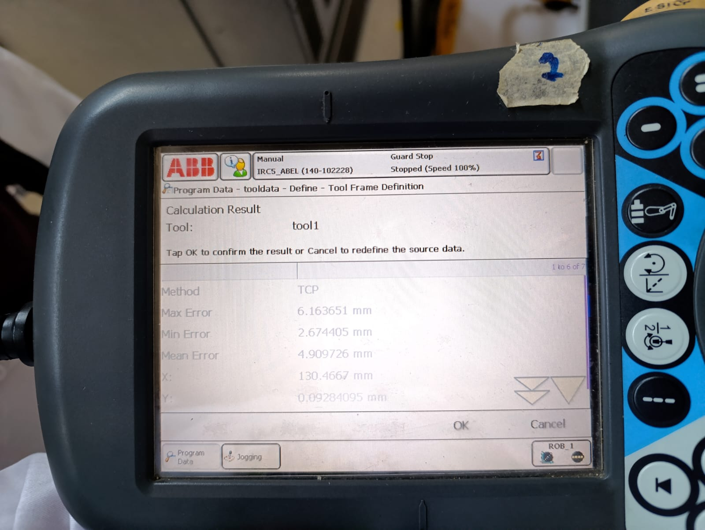
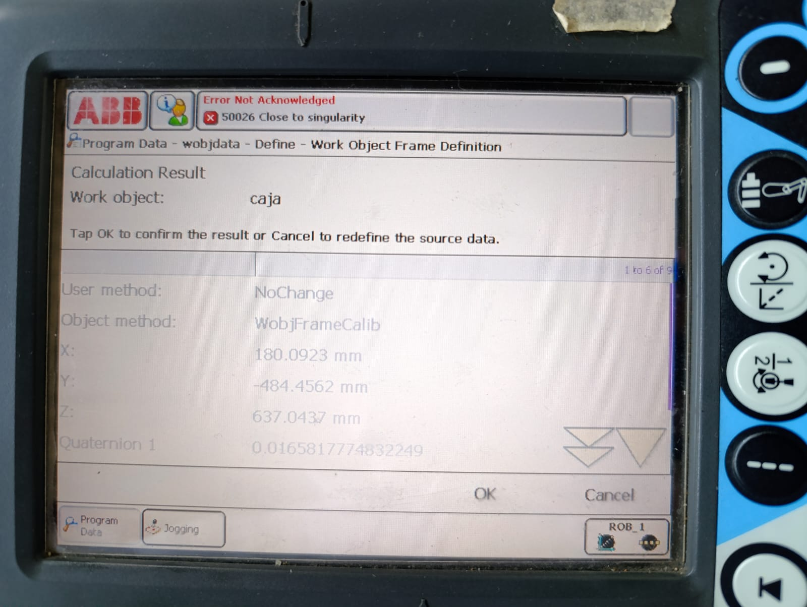
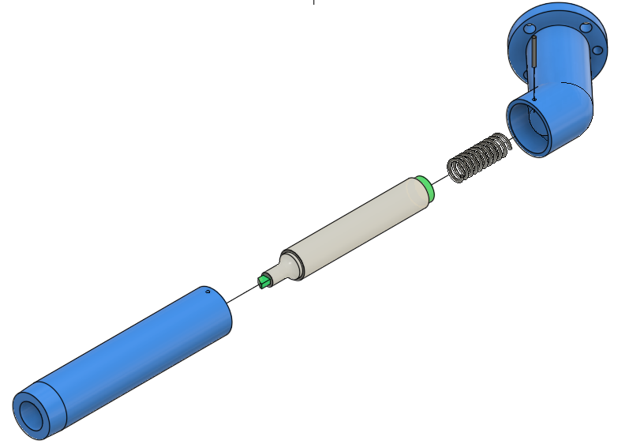

# 🤖 Laboratorio No. 01 - Robótica Industrial
## Trayectorias, Entradas y Salidas Digitales
 
**Robótica Industrial 2026-I** | Universidad Nacional de Colombia
 
---
## 👥 Integrantes
 
| Nombre | 
|--------|
| Duvan Stiven Tique Osorio | 
| Luis Mendoza | 

---
 
## Descripción del Proyecto
 
Decoración de una torta virtual usando un robot industrial ABB IRB 140. El objetivo es escribir nombres y realizar decoraciones sobre una superficie plana mediante trayectorias de movimiento, calibración de herramientas y control de I/O digitales.
 
---
 
## Objetivos
 
- Calibración de herramientas (TCP) en robot real y RobotStudio
- Programación de trayectorias MOVJ y MOVL en RAPID
- Diseño e implementación de herramientas personalizadas
- Uso de Work Objects para cambio de marcos de referencia
- Configuración de entradas y salidas digitales en IRC5
- Integración de sistemas de transporte automatizado
---
 
## Requerimientos
 
### Software
- **RobotStudio** v5.0 o superior
### Hardware
- Robot ABB **IRB 140**
- Controlador **IRC5**
- Banda transportadora con variador de frecuencia
### Documentación
- Manual de especificaciones ABB IRB 140
---
 
 ## Especificaciones del Trabajo
 
### Restricciones de Diseño
 
| Parámetro | Valor |
|-----------|-------|
| Tamaño de torta | 20 personas |
| Velocidad (rango) | 100 - 1000 mm/s |
| Zona tolerable (z) | ±10 mm |
| Posición inicial | HOME robot |
| Posición final | HOME robot |
| Superficie | Torta virtual |
| Nombres | Espaciados |
 
### Herramienta
- Diseñar herramienta para fijar marcador/plumón
- Calibrar TCP (Método de 4 puntos)
1. Abrir el menú ABB → Calibration → Tool.
2. Seleccionar Define New Tool.
3. Importar modelo CAD a RobotStudio
4. Comparar tooldata creado vs importado
5. signar un nombre a la herramienta.
6. Elegir el método 4-point method (método recomendado por ABB para TCPs fijos), en donde se mueve el robot hasta que la punta de la herramienta toque suavemente el punto de referencia (en este caso un punzon) modificando la orientacion general.
7. Guardar Store point 1,2,3,4.
8. Cambiar masa de la herramienta a 1.

   

AL terminar la calibación de la herramienta se obtuvo un error de aproximadamente 6mm, por lo cual si se tiene el modelo CAD de la herramienta es mejor utilizar robotStudio para cargar el TCP al robot.

### Work Object
1. Seleccionar la herramienta previamente calibrada.
2. identificar en la pieza:
- Punto de origen (P0) del WorkObject.
- Punto sobre el eje X (P1).
- Punto que defina el plano XY (P2).
3. Ir a ABB → Calibration → WorkObject.
4. Seleccionar Define New WorkObject.
5. Asignar un nombre.
6. Elegir el método 3-point method.
7. Confirmar la calibración.

### Entradas y Salidas Digitales
 
**Entrada 1**: Iniciar decoración → Enciende luz → Regresa a HOME  
**Entrada 2**: Mantenimiento → Pose de cambio de herramienta → Apaga luz
 
**Salida 1**: Indicador de estado  
**Salida 2**: Control banda transportadora
 
### Control de Transporte
Conectar salida digital IRC5 → Entrada variador → Motor banda
 
Secuencia:
1. Robot finaliza decoración
2. Activa salida digital
3. Banda transportadora se enciende
4. Pastel se trasladada automáticamente
5. Activa entrada digital 1
6. El robot se desplaza hacia la posición de inicio del decorado
7. Empieza el decorado del pastel
8. El robot vuelve a home
9. El pastel se traslada automáticamente
   
---

### Diseño de la Herramienta
La herramienta del robot fue diseñada mediante impresión 3D utilizando PLA como material base. Consta de dos piezas principales: la primera se acopla directamente al robot, mientras que la segunda sostiene el marcador. Ambas piezas se unen mediante un pasador, al cual se incorpora un resorte que permite al marcador tener un rango de movimiento controlado. Este mecanismo asegura que la herramienta no se fracture al entrar en contacto con el workobject, garantizando tanto la funcionalidad como la durabilidad del sistema.

[Planos](PlanosHerramienta.pdf)

---

### Simulaciónn en robotStudio

---

### Implementación en el laboratorio

---

 

