# 🤖 Laboratorio No. 01 - Robótica Industrial

## Trayectorias, Entradas y Salidas Digitales

**Robótica Industrial 2026-I** | Universidad Nacional de Colombia

---

## 👥 Integrantes

| Nombre                      |
|-----------------------------|
| Duvan Stiven Tique Osorio   |
| Luis Mendoza                |

---

## 📋 Descripción del Proyecto

Decoración de una torta virtual usando un robot industrial ABB IRB 140. El objetivo es escribir nombres y realizar decoraciones sobre una superficie plana mediante trayectorias de movimiento, calibración de herramientas y control de entradas y salidas digitales.

---

## 🎯 Objetivos

- Calibración de herramientas (TCP) en robot real y RobotStudio
- Programación de trayectorias MoveJ y MoveL en RAPID
- Diseño e implementación de herramientas personalizadas
- Uso de Work Objects para cambio de marcos de referencia
- Configuración de entradas y salidas digitales en IRC5
- Integración de sistemas de transporte automatizado

---

## 📦 Requerimientos

### Software
- **RobotStudio** v5.0 o superior
- Lenguaje de programación: **RAPID**

### Hardware
- Robot ABB **IRB 140**
- Controlador **IRC5**
- Banda transportadora con variador de frecuencia
- Sistema de herramientas personalizadas

### Documentación
- Manual de especificaciones ABB IRB 140
- Documentación de configuración IRC5

---

## 🔧 Especificaciones del Trabajo

### Restricciones de Diseño

| Parámetro                | Valor          |
|--------------------------|----------------|
| Tamaño de torta          | 20 personas    |
| Velocidad (rango)        | 100 - 1000 mm/s|
| Zona tolerable (Z)       | ±10 mm         |
| Posición inicial         | HOME robot     |
| Posición final           | HOME robot     |
| Superficie               | Torta virtual  |
| Disposición de nombres   | Espaciados     |

---

## 🛠️ Calibración de Herramienta (TCP)

### Procedimiento

1. **Abrir menú de calibración:** ABB → Calibration → Tool
2. **Crear nueva herramienta:** Seleccionar "Define New Tool"
3. **Importar modelo CAD:** Cargar modelo 3D a RobotStudio
4. **Comparar datos:** Verificar tooldata creado vs importado
5. **Asignar nombre:** Nombrar la herramienta adecuadamente
6. **Seleccionar método:** Utilizar "4-Point Method" (recomendado por ABB para TCP fijos)
   - El robot se mueve hasta que la punta de la herramienta toque suavemente el punto de referencia
   - Modificar la orientación general del robot según sea necesario
7. **Guardar puntos:** Confirmar points 1, 2, 3 y 4
8. **Configurar masa:** Ajustar masa de la herramienta a 1 kg

### Resultados Obtenidos


**Error obtenido:** Aproximadamente 6 mm

**Recomendación:** Si se dispone del modelo CAD de la herramienta, es preferible utilizar RobotStudio para cargar el TCP directamente al robot, evitando errores de calibración.

---

## 📍 Calibración del Work Object

### Procedimiento

1. **Seleccionar herramienta:** Usar la herramienta previamente calibrada
2. **Identificar puntos de referencia en la pieza:**
   - **P0:** Punto de origen del WorkObject
   - **P1:** Punto sobre el eje X
   - **P2:** Punto que define el plano XY
3. **Abrir menú de calibración:** ABB → Calibration → WorkObject
4. **Crear nuevo WorkObject:** Seleccionar "Define New WorkObject"
5. **Asignar nombre:** Denominar el WorkObject apropiadamente
6. **Elegir método:** Utilizar "3-Point Method"
7. **Confirmar calibración:** Validar los puntos ingresados

### Resultados Obtenidos


---

## 🔌 Entradas y Salidas Digitales

### Configuración de Señales

#### Entradas Digitales (DI)
- **DI_01:** Sensor de presencia de pastel
  - Función: Iniciar secuencia de decoración
  - Acción: Enciende luz indicadora, inicia decorado, regresa a HOME

- **DI_02:** Señal de mantenimiento
  - Función: Activar modo mantenimiento del robot
  - Acción: Robot se desplaza a posición de cambio de herramienta, apaga luz indicadora

#### Salidas Digitales (DO)
- **DO_01:** Indicador de estado de decoración
  - Función: Luz testigo de proceso en curso
  
- **DO_02:** Control de banda transportadora
  - Función: Activar/desactivar movimiento de la banda transportadora

---

## 🚚 Control de Transporte

### Secuencia de Operación

1. Robot finaliza decoración de pastel
2. Activa salida digital DO_02
3. Banda transportadora se enciende y mueve el pastel
4. Pastel se traslada automáticamente fuera del área de decorado
5. Entra un nuevo pastel, activa entrada digital DI_01
6. Robot se desplaza hacia la posición inicial de decorado
7. Inicia secuencia de decorado (LUIS y DUVAN)
8. Robot retorna a posición HOME
9. Ciclo se repite automáticamente

### Conexión Física
- Salida digital IRC5 → Entrada de variador de frecuencia → Motor de banda transportadora

---

## 📊 Flujos de Operación

### Rutina de Decorado



**Descripción:** Secuencia completa para decorar un pastel con los nombres "LUIS" y "DUVAN".

---

### Rutina de Mantenimiento



**Descripción:** Proceso para activar el modo de mantenimiento y cambio de herramientas.

---

## 💻 Funciones Utilizadas en el Código RAPID

### Constantes

#### Objetivos Robóticos (robtarget)

##### `BaseDraw`
```rapid
CONST robtarget BaseDraw:=[[0,0,0],
    [0.694346616,0.10879539,-0.122149941,0.700803633],
    [-1,-1,0,0],
    [9E9,9E9,9E9,9E9,9E9,9E9]];
```
**Descripción:** Punto de origen (0, 0, 0) que sirve como referencia base para el cálculo de posiciones relativas de dibujo. Define la orientación inicial de la herramienta mediante cuaterniones.

**Componentes:**
- Posición cartesiana: [0, 0, 0] mm
- Orientación (cuaterniones): [0.694, 0.109, -0.122, 0.701]
- Configuración de eje: [-1, -1, 0, 0]
- Datos extendidos: [9E9, 9E9, 9E9, 9E9, 9E9, 9E9]

---

##### `HOME`
```rapid
CONST robtarget HOME:=[[-413.972133,684.456,139.157599],
    [0.989015864,0,-0.147809404,0],
    [0,0,0,0],
    [9E9,9E9,9E9,9E9,9E9,9E9]];
```
**Descripción:** Posición de reposo primaria del robot. Posición de seguridad donde el robot aguarda nuevos pasteles y desde donde inicia el ciclo de decorado.

**Componentes:**
- Posición cartesiana: [-413.97, 684.46, 139.16] mm
- Orientación: [0.989, 0, -0.148, 0]
- Configuración de eje: [0, 0, 0, 0]

**Uso:** Punto de partida y destino final después de completar el decorado.

---

##### `HOME2`
```rapid
CONST robtarget HOME2:=[[-370.116379342,684.456,-4.288115021],
    [0.989015864,0,-0.147809404,0],
    [0,0,0,0],
    [9E9,9E9,9E9,9E9,9E9,9E9]];
```
**Descripción:** Posición de aproximación intermedia, ubicada entre HOME y el área de dibujo. Reduce vibraciones y mejora la precisión mediante aproximación gradual.

**Componentes:**
- Posición cartesiana: [-370.12, 684.46, -4.29] mm
- Orientación: [0.989, 0, -0.148, 0]

**Uso:** Paso intermedio en el descenso para mejorar estabilidad y precisión.

---

##### `Target_aproximacion`
```rapid
CONST robtarget Target_aproximacion:=[[172.3445,164.9723,-139.7743],
    [0.694346616,0.10879539,-0.122149941,0.700803633],
    [-1,-1,0,0],
    [9E9,9E9,9E9,9E9,9E9,9E9]];
```
**Descripción:** Posición final de aproximación, 20 mm por encima del área de escritura. Punto de transición antes del descenso final para iniciar el decorado.

**Componentes:**
- Posición cartesiana: [172.34, 164.97, -139.77] mm
- Orientación: [0.694, 0.109, -0.122, 0.701]

**Uso:** Última posición de seguridad antes de bajar a la altura de escritura.

---

#### Constantes Numéricas

##### Dimensiones de Letras
```rapid
CONST num l_width := 40;    ! Ancho de cada letra [mm]
CONST num l_height := 60;   ! Altura de cada letra [mm]
CONST num l_space := 15;    ! Espaciado entre letras [mm]
```
**Descripción:** Definen el tamaño y espaciado de las letras dibujadas.

**Valores:**
- `l_width`: 40 mm - Ancho estándar para cada letra
- `l_height`: 60 mm - Altura estándar de caracteres
- `l_space`: 15 mm - Separación horizontal entre letras

**Impacto:** Estos valores determinan la legibilidad y tamaño visual final del texto decorado.

---

##### Alturas de Operación
```rapid
CONST num z_draw := 0;      ! Altura de escritura [mm]
CONST num z_lift := -20;    ! Altura de levantamiento [mm]
```
**Descripción:** Alturas relativas del eje Z para operaciones de escritura y seguridad.

**Valores:**
- `z_draw`: 0 mm - Altura donde la herramienta hace contacto para escribir
- `z_lift`: -20 mm - Altura de despegue/seguridad

**Nota Técnica:** Si la escritura no es óptima, considerar ajustar `z_draw` a +5 mm.

---

### Variables

#### `pActual`
```rapid
VAR robtarget pActual;
```
**Tipo:** `robtarget` (posición robótica tridimensional)

**Descripción:** Variable dinámica que almacena la posición actual durante la secuencia de dibujo. Se actualiza constantemente mediante desplazamientos relativos (`Offs()`) para posicionar cada letra.

**Uso en programa:**
- Se inicializa en BaseDraw + offset para LUIS
- Se incrementa por (l_width + l_space) después de cada letra
- Se reinicializa para el grupo de DUVAN

**Ejemplo:**
```rapid
pActual := Offs(BaseDraw, 30, 20, 0);  ! Posición inicial de LUIS
Draw_L;
pActual := Offs(pActual, l_width + l_space, 0, 0);  ! Siguiente letra
```

---

**Parámetros de movimiento:**
- `v1000`: 1000 mm/s - Aproximación inicial rápida
- `v800`: 800 mm/s - Aproximación intermedia
- `v500`: 500 mm/s - Aproximación final controlada
- `v300`: 300 mm/s - Descenso seguro
- `v100`: 100 mm/s - Velocidad de escritura precisada
- `fine`: Precisión fina en punto destino

---

## 📁 Código RAPID

El código completo del módulo RAPID está disponible en el archivo `Module1.mod`.

[Ver código fuente completo](Module1.mod)

---

## 🎨 Diseño de la Herramienta

La herramienta del robot fue diseñada mediante impresión 3D utilizando PLA como material base. 

**Características:**
- **Estructura:** Dos piezas principales
  - Primera pieza: Se acopla directamente al robot
  - Segunda pieza: Sostiene el marcador
- **Unión:** Pasador con resorte incorporado
- **Función del resorte:** Permite al marcador tener un rango de movimiento controlado
- **Beneficios:** Evita fracturas al entrar en contacto con la superficie y garantiza funcionalidad y durabilidad

### Visualización


**Documentación:** [Planos detallados de la herramienta](PlanosHerramienta.pdf)

---

## 🎥 Simulación en RobotStudio

Visualice la simulación completa del proceso de decorado en RobotStudio:

[](https://youtu.be/98ZQVTQvyAo)

**Descripción:** Simulación del ciclo completo incluyendo movimientos, dibujo de nombres y retorno a posición inicial.

---

## 🏭 Implementación en Laboratorio

Implementación real del sistema en el laboratorio de robótica:

[](https://youtu.be/yADe7vtRQms)

**Descripción:** Prueba del robot ABB IRB 140 decorando un pastel con los nombres "LUIS" y "DUVAN".

---


 

